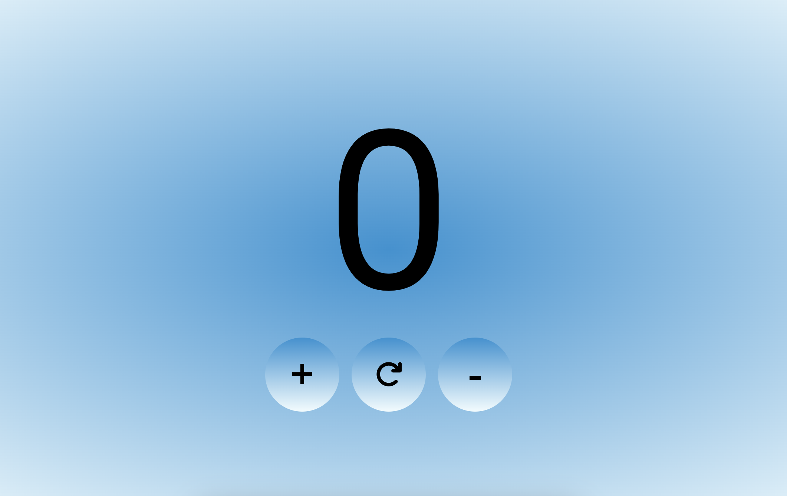

# Counter

## Funzionamento

Semplice counter che viene incrementato e decrementato con l'ausilio di tre bottoni: +, -, reset.
Al primo accesso l'utente visualizzerà il valore di default (0) successivamente, agli accessi successivi, l'utente visualizzerà l'ultimo valore impostato.

## Dagli uno sguardo

Se vuoi vedere realmente come funziona vai al link

## Strumenti

Per la realizzazione del sito sono stati utilizzati i linguaggi:

- HTML
- CSS
- Javascript

è stata utilizzata la metodologia CUBE CSS, è stata utilizzato SCSS come preprocessore, Parcel come web application bundler e sono stati utilizzati gli strumenti messi a disposizione da [Utopia](https://utopia.fyi/) per realizzare il sito in maniera fluid.
